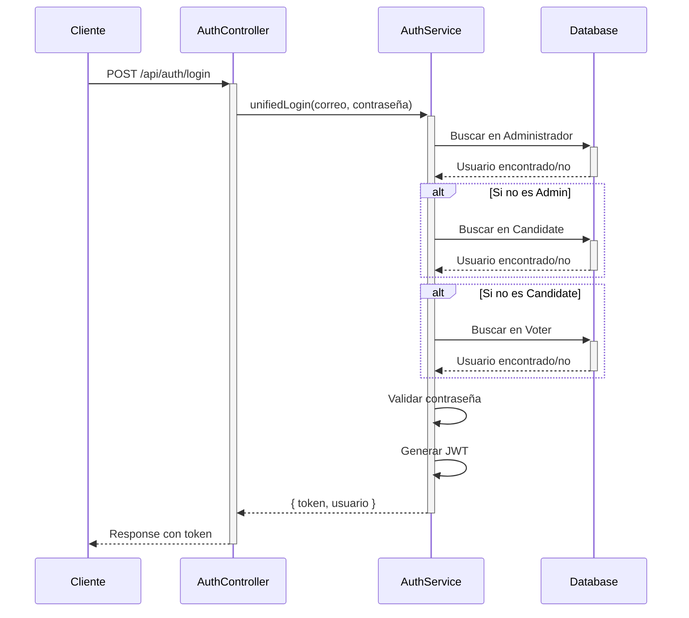

<h1 align="center">Univote Backend (NestJS + Prisma)</h1>

> Plataforma de votaciones universitarias. Este backend implementa autenticación JWT multi-rol, gestión de elecciones, candidatos, propuestas, votantes, resultados y notificaciones. Incluye documentación Swagger dinámica, pruebas E2E, subida de archivos y un esquema de base de datos mantenido con Prisma.

---

## 1. Visión General

El objetivo del sistema Univote es permitir la administración y participación en procesos electorales universitarios:

- Administradores: crean y gestionan elecciones, aprueban/rechazan candidatos, monitorean estadísticas.
- Candidatos: se postulan, suben foto y propuestas, reciben notificaciones de aprobación/rechazo.
- Votantes: consultan elecciones, propuestas y emiten voto (incluye manejo de "Voto en Blanco").

Características clave ya implementadas:

| Módulo | Estado | Descripción breve |
|--------|--------|-------------------|
| Autenticación JWT | ✅ | Login independiente por rol; tokens portan rol para guard de autorización. |
| Autorización por Roles | ✅ | Decorador `@Roles()` y `RolesGuard` restringen endpoints. |
| Documentación Swagger | ✅ | Generada dinámicamente en `/docs` con persistencia de autorización. |
| Prisma + PostgreSQL | ✅ | Modelos normalizados y migraciones versionadas; múltiples correcciones de relaciones. |
| Subida de archivos | ✅ | Fotos de candidatos vía Multer; almacenamiento en `uploads/candidatos`. |
| Propuestas | ✅ | CRUD condicionado a estado del candidato y propuesta. |
| Resultados / Estadísticas | ✅ | Conteo de votos, verificación de condiciones para inicio de elección, estadísticas agregadas. |
| Semilla inicial | ✅ | Roles, carreras y administrador base. |
| Pruebas E2E | ✅ | Login, endpoints protegidos y restricciones de rol. |
| Estrictificación TypeScript | ✅ | Ajustes para `strict` (definite assignment assertions y manejo de `unknown`). |

---

## 2. Stack Tecnológico

- **Runtime**: Node.js (NestJS 11)
- **ORM**: Prisma 6 (cliente personalizado en `generated/prisma`)
- **DB**: PostgreSQL
- **Auth**: JWT (Passport + `@nestjs/jwt`)
- **Validación**: `class-validator` + `class-transformer`
- **Documentación**: Swagger (`@nestjs/swagger`)
- **Tests**: Jest + Supertest (E2E y unitarios mínimos)
- **Subida y procesamiento de imágenes**: Multer + Sharp
- **Email**: Nodemailer (servicio de contacto / notificaciones)
- **Front-end / Mobile**: Repositorio monorepo con Vite (Frontend) y React Native (UnivoteMobile)

---

## 3. Estructura del Proyecto (Backend)

```
Backend/
  src/
    administrators/
    candidates/
    careers/
    elections/
    proposals/
    voters/
    votes/
    results/
    role/
    notications/ (typo histórico)
    email/
    interceptors/ (BigIntInterceptor)
    prisma/ (PrismaService)
    main.ts (bootstrap y Swagger)
  prisma/
    schema.prisma
    migrations/
    seed.ts
  uploads/
    candidatos/
  generated/
    prisma/ (cliente Prisma generado)
```

Notas:
- El cliente Prisma se genera en `generated/prisma` mediante la directiva `output` del generador.
- La carpeta `uploads` sirve imágenes estáticas a través de Nest (rutas con prefijo `/uploads`).
- Se corrigió inconsistencia singular/plural en relación `results` (antes `result`).

---

## 4. Modelado de Datos (Prisma)

Relaciones principales resumidas:

| Modelo | Relaciones |
|--------|------------|
| Administrador | `elections` (1:N) |
| Election | `administrador` (N:1), `candidates` (1:N), `voters` (1:N), `results` (1:N), `proposals` (1:N), `Vote` (1:N) |
| Candidate | `role` (N:1), `career` (N:1), `election` (N:1 opcional), `proposals` (1:N), `results` (1:N), `votes` (1:N), `notifications` (1:N) |
| Voter | `role` (N:1), `career` (N:1), `election` (N:1 opcional), `vote` (1:N) |
| Vote | `voter` (N:1 opcional), `candidate` (N:1 opcional), `election` (N:1 opcional) |
| Proposal | `candidate` (N:1), `election` (N:1 opcional) |
| Career | `voters` (1:N), `candidates` (1:N) |
| Result | `election` (N:1), `candidate` (N:1) con índice único compuesto (`electionId`, `candidateId`) |
| Role | `voters` (1:N), `candidates` (1:N) |
| Notification | `candidate` (N:1, cascade delete) |

Cambios relevantes históricos:
- Se volvió opcional `electionId` en `Voter` y `Candidate` para permitir pre-registro antes de asociación.
- Se introdujo índice único compuesto en `Result` para evitar duplicados por elección/candidato.
- Se ajustó foto del candidato a opcional (`foto_candidate String?`).
- Se agregó soporte para "Voto en Blanco" creado dinámicamente al activar la elección.

---

## 5. Autenticación y Autorización

### Sistema de Autenticación Unificado

A partir de la versión actual, el sistema utiliza un **endpoint de login unificado** que maneja la autenticación de todos los roles:

#### Endpoint Principal
```
POST /api/auth/login
```

**Ventajas:**
- ✅ Un único endpoint para todos los roles
- ✅ Generación automática de JWT tokens
- ✅ Detección automática del tipo de usuario
- ✅ Validación de contraseñas con bcrypt
- ✅ Rehashing automático de contraseñas legacy

#### Flujo de Autenticación



#### Request/Response

**Request:**
```json
{
  "correo": "admin@univote.com",
  "contrasena": "admin123"
}
```

**Response:**
```json
{
  "token": "eyJhbGciOiJIUzI1NiIsInR5cCI6IkpXVCJ9.eyJzdWIiOjEsInJvbGUiOiJBRE1JTiIsImlhdCI6MTcwMDAwMDAwMCwiZXhwIjoxNzAwMDg2NDAwfQ.signature",
  "usuario": {
    "id": 1,
    "nombre": "Admin",
    "rol": "ADMIN",
    "correo": "admin@univote.com"
  }
}
```

### Payload JWT

El token JWT contiene:
```typescript
{
  sub: number;      // ID del usuario
  role: string;     // "ADMIN" | "CANDIDATE" | "VOTER"
  iat: number;      // Timestamp de emisión
  exp: number;      // Timestamp de expiración
}
```

### Estrategia JWT

- **Archivo:** `src/auth/jwt.strategy.ts`
- **Función:** Valida tokens y extrae información del usuario
- **Integración:** Se ejecuta automáticamente en rutas protegidas con `@UseGuards(JwtAuthGuard)`

### Guards de Autorización

#### JwtAuthGuard
Verifica que el request tenga un token JWT válido.

```typescript
@UseGuards(JwtAuthGuard)
@Get('protected-endpoint')
protectedRoute() {
  return { message: 'Acceso autorizado' };
}
```

#### RolesGuard
Verifica que el usuario tenga los roles requeridos.

```typescript
@UseGuards(JwtAuthGuard, RolesGuard)
@Roles('ADMIN', 'CANDIDATE')
@Get('admin-or-candidate-only')
restrictedRoute() {
  return { message: 'Solo admin o candidato' };
}
```

### Decorador @Roles()

Define qué roles pueden acceder a un endpoint:

```typescript
@Roles('ADMIN')              // Solo administradores
@Roles('CANDIDATE')          // Solo candidatos
@Roles('VOTER')              // Solo votantes
@Roles('ADMIN', 'CANDIDATE') // Administradores O candidatos
```

### Endpoints de Autenticación Existentes

Aunque existe el endpoint unificado, los endpoints legacy aún funcionan:

| Endpoint | Método | Descripción | Estado |
|----------|--------|-------------|--------|
| `/api/auth/login` | POST | **Login unificado (RECOMENDADO)** | ✅ Activo |
| `/administrators/login` | POST | Login de administrador | ⚠️ Legacy |
| `/candidates/login` | POST | Login de candidato | ⚠️ Legacy |
| `/voters/login` | POST | Login de votante | ⚠️ Legacy |

**Nota:** Los endpoints legacy **NO generan JWT tokens**, solo retornan datos del usuario. Usar `/api/auth/login` para autenticación completa.

### Protección de Rutas

Ejemplo de controlador protegido:

```typescript
import { Controller, Get, UseGuards } from '@nestjs/common';
import { JwtAuthGuard } from '../auth/jwt-auth.guard';
import { RolesGuard } from '../auth/roles.guard';
import { Roles } from '../auth/roles.decorator';

@Controller('elections')
@UseGuards(JwtAuthGuard, RolesGuard)
export class ElectionsController {
  
  @Get()
  @Roles('ADMIN', 'CANDIDATE', 'VOTER')
  findAll() {
    // Todos los usuarios autenticados
  }

  @Post()
  @Roles('ADMIN')
  create() {
    // Solo administradores
  }
}
```

### Endpoints críticos (conceptual)

| Recurso | Ejemplos |
|---------|----------|
| Administrators | crear, login, actualizar perfil, validar contraseña |
| Candidates | aplicar, aprobar/rechazar, listar por elección, subir foto |
| Voters | registrar, listar, asociar a elección |
| Elections | crear, listar, activar/cerrar, estadísticas, resultados |
| Proposals | crear, listar por candidato, activar/inactivar |
| Votes | emitir voto, conteo por candidato |
| Results | obtener consolidado de votos (candidatos + blancos) |

---

## 6. Lógica de Elecciones

Funciones clave en `ElectionsService`:

| Método | Propósito |
|--------|-----------|
| `getResults()` | Recorre elecciones y agrega conteo de votos por candidato. |
| `canStartElection()` / `canStartSimple()` | Verifica condiciones para activar (candidato aprobado + propuesta activa). |
| `addBlankVoteToElection()` | Inserta candidato "Voto en Blanco" si no existe al iniciar elección. |
| `getElectionStats(id)` | Retorna métricas: total de candidatos reales aprobados, propuestas activas, votantes y votos. |
| `getElectionsWithCandidateCount()` | Lista elecciones con conteo de candidatos aprobados con propuestas activas. |
| `getElectionProposals(electionId)` | Devuelve propuestas activas con datos del candidato. |

Consideraciones:
- Se filtran solo propuestas con `estado_proposal = "Activa"` y candidatos con `estado_candidate = "Aprobado"` para cálculos de inicio.
- El "Voto en Blanco" se considera aprobado pero excluido de conteos de candidatos reales en estadísticas.
- Formateo de fechas a locale `es-ES` y zona UTC para salida consistente.

---

## 7. Subida de Archivos e Imágenes

- Middleware Multer configurado para recibir fotos de candidatos.
- Almacenamiento físico en `uploads/candidatos/`.
- Servidos como estáticos con prefijo `/uploads/candidatos/`.
- Se aplica `BigIntInterceptor` para serializar valores BigInt en respuestas JSON.

---

## 8. Semilla y Migraciones

Scripts:

| Script | Acción |
|--------|--------|
| `npx prisma migrate dev` | Aplica migraciones pendientes y genera cliente. |
| `npm run db:seed` | Ejecuta `prisma/seed.ts` (roles, carreras, admin). |
| `npm run dev:local` | Carga `.env.local`, migra, seed y arranca en modo watch. |

Semilla (`prisma/seed.ts`):
1. Upsert de roles: `ADMINISTRADOR`, `CANDIDATO`, `VOTANTE`.
2. Inserción de carreras ejemplo (Sistemas, Industrial, Administración, Contaduría, Diseño Gráfico).
3. Creación de administrador base: correo `admin@univote.com`, contraseña `admin123` (bcrypt hash).

### Problemas Corregidos

- Error Prisma P2021/P2022: tablas y columnas inexistentes -> solucionado aplicando migraciones correctas y regenerando cliente.
- Inconsistencia de puertos (Docker vs local) -> puerto final backend 3000.
- Relación `result` vs `results` unificada al plural con ajustes en includes.
- Generación cliente Prisma apuntando a salida personalizada.

---

## 9. Validación, Sanitización y Transformaciones

- `ValidationPipe` global con:
  - `whitelist: true` (se eliminan propiedades extra)
  - `forbidNonWhitelisted: true` (error ante propiedades no permitidas)
  - `transform: true` + conversiones implícitas
- Convertir fechas a strings legibles para respuestas públicas.
- Interceptor BigInt para evitar problemas de serialización.

---

## 10. Pruebas (Jest + Supertest)

Pruebas E2E cubren:
- Login inválido (rechazo con credenciales erróneas)
- Endpoint protegido (rechazo sin token / acceso con token)
- Restricción de rol (usuario con rol incorrecto recibe 403)

Scripts disponibles:
```bash
npm run test        # unit + e2e (según patrón)
npm run test:e2e    # e2e específico (config test/jest-e2e.json)
npm run test:cov    # cobertura
npm run test:watch  # modo observador
```

Estrategia recomendada para nuevas pruebas:
1. Sembrar datos mínimos (seed).
2. Crear usuarios/candidatos con factories o directamente vía Prisma.
3. Reutilizar tokens obtenidos en la fase de login para pruebas protegidas.

---

## 11. Scripts NPM (Backend)

| Script | Descripción |
|--------|-------------|
| `build` | Compila TypeScript a `dist/`. |
| `start` | Arranque simple (sin watch). |
| `start:dev` | Modo desarrollo con recarga. |
| `start:prod` | Ejecuta `dist/main`. |
| `lint` | ESLint + auto-fix. |
| `format` | Prettier escritura en `src` y `test`. |
| `dev:local` | Migrar + seed + watch con `.env.local`. |
| `dev:docker` | Igual pero usando `.env.docker`. |
| `db:seed` | Ejecuta script de semilla. |
| `test:*` | Variantes de prueba (watch, cov, debug, e2e). |

---

## 12. Configuración de Entorno

### Archivo `.env.local`

Variables principales (local):

| Variable | Valor por Defecto | Descripción |
|----------|-------------------|-------------|
| `DATABASE_URL` | `postgresql://postgres:@localhost:5432/Univote?schema=public` | Cadena de conexión a PostgreSQL |
| `JWT_SECRET` | `univote_local_dev_secret_2024` | Secreto para firmar tokens JWT |
| `JWT_EXPIRES_IN` | `24h` | Duración de los tokens JWT |
| `ALLOWED_ORIGINS` | `http://localhost:5173,http://localhost:3000` | Orígenes permitidos para CORS |
| `EMAIL_USER` | - | Usuario SMTP para nodemailer (opcional) |
| `EMAIL_PASS` | - | Contraseña SMTP para nodemailer (opcional) |
| `PORT` | `3000` | Puerto del servidor backend |

### Ejemplo de `.env.local`

```bash
# Base de datos local sin contraseña
DATABASE_URL=postgresql://postgres:@localhost:5432/Univote?schema=public

# JWT
JWT_SECRET=univote_local_dev_secret_2024
JWT_EXPIRES_IN=24h

# CORS
ALLOWED_ORIGINS=http://localhost:5173,http://localhost:3000

# Email (opcional)
EMAIL_USER=tu_email@gmail.com
EMAIL_PASS=tu_contraseña_app
```

### Recomendaciones de Producción

- ✅ Cambiar `JWT_SECRET` a un string aleatorio de al menos 32 caracteres
- ✅ Usar contraseña fuerte para PostgreSQL
- ✅ Restringir CORS a dominios específicos de producción
- ✅ Habilitar SSL para conexión de base de datos
- ✅ Usar variables de entorno seguras (AWS Secrets Manager, etc.)

---

## 13. Swagger

- Disponible en: `http://localhost:3000/docs`
- Persistencia de autorización habilitada (`persistAuthorization: true`).
- Configurado con esquema Bearer.
- Actualización automática al modificar controladores / DTOs.

### Mejores Prácticas Swagger pendientes
- Añadir `@ApiTags()` consistente en todos los controladores.
- Documentar modelos de respuesta personalizados para endpoints complejos (estadísticas, resultados). 

---

## 14. Manejo de Errores

- Uso de excepciones Nest (`BadRequestException`, `UnauthorizedException`, `ForbiddenException`) según contexto.
- Captura de errores Prisma: códigos como P2021/P2022 se transforman en mensajes claros para diagnóstico.
- Estandarización pendiente: middleware global para mapear errores en un formato uniforme (`{ statusCode, message, timestamp }`).

---

## 15. Voto en Blanco

- Insertado automáticamente al activar una elección (`updateStatus` -> `addBlankVoteToElection`).
- Genera número de documento único basado en el mayor existente (o fallback grande si no hay candidatos).
- Usa un rol tipo candidato y la primera carrera disponible.
- Excluido de conteos de candidatos reales en estadísticas (`getElectionStats`).

---

## 16. Seguridad y Buenas Prácticas

Actual:
- Hash de contraseñas con bcrypt (factor 10).
- CORS restringido a puertos locales de desarrollo.
- Validación estricta de DTOs (sanitiza entradas desconocidas).

Recomendado:
- Implementar rate limiting en endpoints de login.
- Rotación de JWT (refresh tokens) si se requieren sesiones prolongadas.
- Subir fotos a almacenamiento externo (S3 / Cloud Storage) en producción.
- Añadir Helmet para cabeceras seguras.

---

## 17. Problemas Comunes y Solución

| Problema | Causa | Solución |
|----------|-------|----------|
| P2021 (tabla no existe) | Migraciones no aplicadas | `npx prisma migrate dev` |
| P2022 (columna no existe) | Cliente Prisma desfasado | `npx prisma generate` tras actualizar schema |
| Error seed `@prisma/client did not initialize` | Import incorrecto con output personalizado | Usar `import { PrismaClient } from '../generated/prisma'` |
| CORS bloquea peticiones frontend | Origen no incluido | Añadir a array `origin` en `main.ts` |
| Fotos no sirven estáticos | Prefijo incorrecto | Revisar configuración `app.useStaticAssets` |

---

## 18. Pasos Rápidos para Desarrollar (Local)

```bash
# 1. Instalar dependencias
npm install

# 2. Crear base de datos PostgreSQL
psql -U postgres -c "CREATE DATABASE \"Univote\";"

# 3. Configurar variables de entorno
cp .env.example .env.local
# Editar .env.local según necesidades

# 4. Aplicar migraciones y seed
npx prisma migrate dev
npm run db:seed

# 5. Iniciar servidor de desarrollo
npm run start:dev

# 6. Abrir Swagger
http://localhost:3000/docs

# 7. Probar login administrador (Endpoint Unificado)
POST http://localhost:3000/api/auth/login
{
  "correo": "admin@univote.com",
  "contrasena": "admin123"
}

# Respuesta esperada:
{
  "token": "eyJhbGciOiJIUzI1NiIsInR5cCI6IkpXVCJ9...",
  "usuario": {
    "id": 1,
    "nombre": "Admin",
    "rol": "ADMIN",
    "correo": "admin@univote.com"
  }
}
```

### Usuarios de Prueba Disponibles

Después de ejecutar el seed, tendrás acceso a:

**Administrador:**
- Email: `admin@univote.com`
- Contraseña: `admin123`

**Votantes:** (10 usuarios)
- Email: `juan.perez@estudiante.univote.com`
- Contraseña: `voter123`
- _(y 9 votantes más - ver seed.ts)_

**Candidatos:** (10 usuarios)
- Email: `roberto.sanchez@candidato.univote.com`
- Contraseña: `candidate123`
- _(y 9 candidatos más - ver seed.ts)_

---

## 19. Roadmap Futuro

| Ítem | Prioridad | Descripción |
|------|-----------|-------------|
| Test unitarios por servicio | Media | Cubrir lógica interna (stats, blank vote). |
| Rate limiting / Helmet | Alta | Endurecer seguridad. |
| Refresh tokens | Media | Sesiones más seguras prolongadas. |
| Auditoría de acciones | Baja | Log centralizado de cambios administrativos. |
| Internacionalización | Baja | Mensajes en múltiples idiomas. |
| CI/CD | Media | Pipeline para lint, test y despliegue automático. |

---

## 20. Licencia

Código interno privado (UNLICENSED). Para despliegue público evaluar adopción de licencia apropiada.

---

## 21. Créditos

Construido sobre NestJS. Equipo Univote y colaboradores internos.

---

Si necesitas más detalle en algún módulo (ej: votación, propuestas, notificaciones) abre un issue interno o extiende este README con ejemplos de request/response.

---

> Última actualización: sincronización de esquema Prisma, semilla inicial y ajuste de includes `results`.
